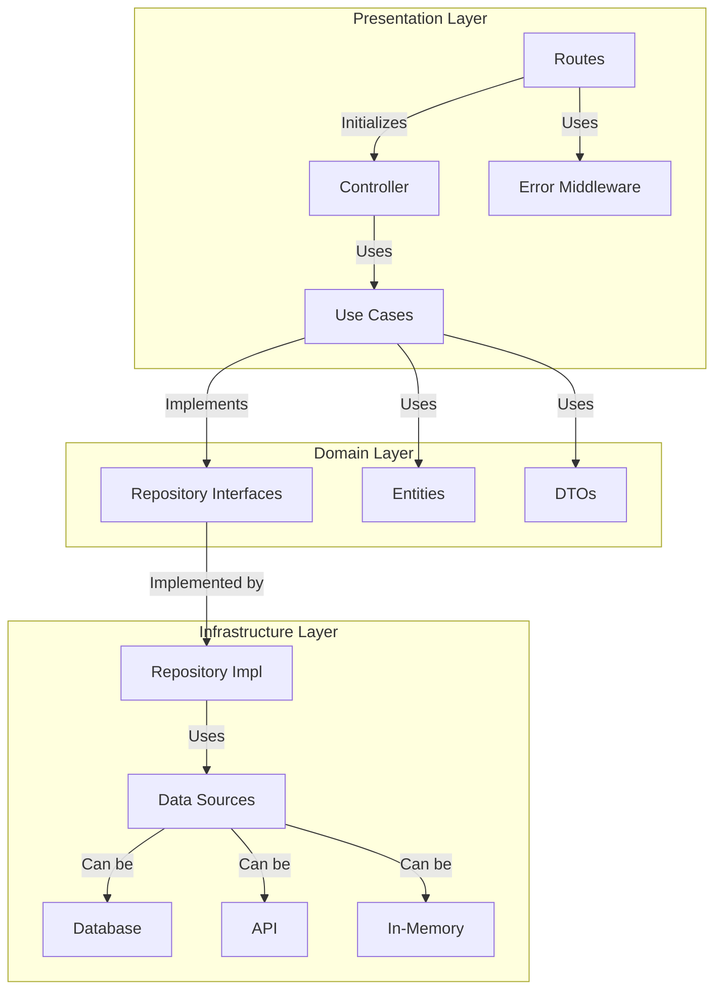
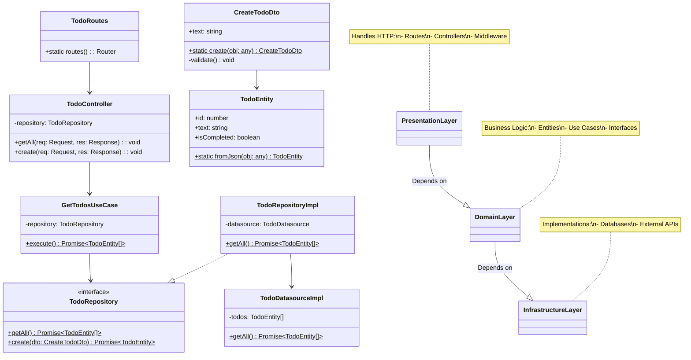

**Objective:** Generate `fm_stack` API components following these strict `Clean Architecture patterns` 

## Directory Structure:

Here is the directory structure of the target repository

```bash
src/
  features/
    {resource}/          # e.g., todos/
      domain/
        entities/        # Business objects 
        dtos/            # Data Transfer Objects  
        repositories/    # Abstract interfaces
        usecases/        # Business logic   (paths for this reosurce)
        datasources/     # Data source interfaces
      infrastructure/    # Implementations
      presentation/      # Controllers & routes
```

---

## high level architecture diagram 

The following diagram shows the main layers and the flow between them in the  target clean architecture repository



## Here is a class diagram with a focus on the details of different classes.


## Key Principles to Enforce:
1. **Dependency Rule**: Inner layers (domain) must never import outer layers (infrastructure/presentation)
2. **Testability**: All components must be mockable via interfaces
3. **Validation**: Entities/DTOs validate themselves
4. **Error Handling**: Consistent error formats across layers

##  Error Handling

Pattern: Centralized error middleware

```ts
// core/errors/custom.error.ts
class AppError extends Error {
  constructor(
    public readonly statusCode: HttpCode,
    public readonly validationErrors?: { field: string; constraint: string }[]
  ) {}
}

// presentation/middlewares/error.middleware.ts
function handleError(error: unknown, res: Response) {
  if (error instanceof AppError) {
    res.status(error.statusCode).json({
      error: error.message,
      details: error.validationErrors
    });
  }
}
```

##  Validation Types

Centralized Validation types used by all

```ts
// core/types/index.ts
export interface ValidationType {
	fields: string[];
	constraint: string;
}

export interface SuccessResponse<T> {
	data?: T;
}

export interface ErrorResponse {
	name: string;
	message: string;
	validationErrors?: ValidationType[];
	stack?: string;
}
```

## Input: The OpenAPI spec file: 

Here is the specs: `openapi.json` for the project: `fm_project_name`:

fm_openapi_specs
